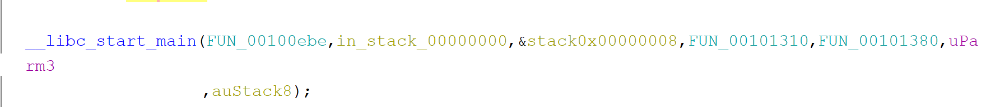
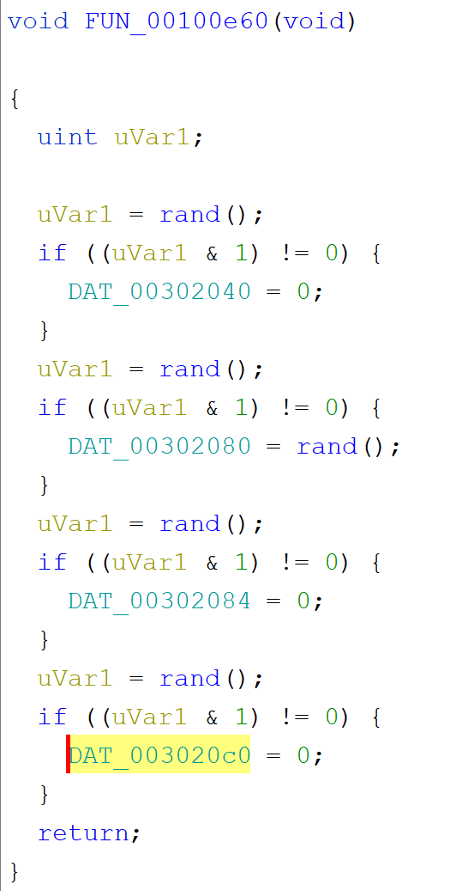
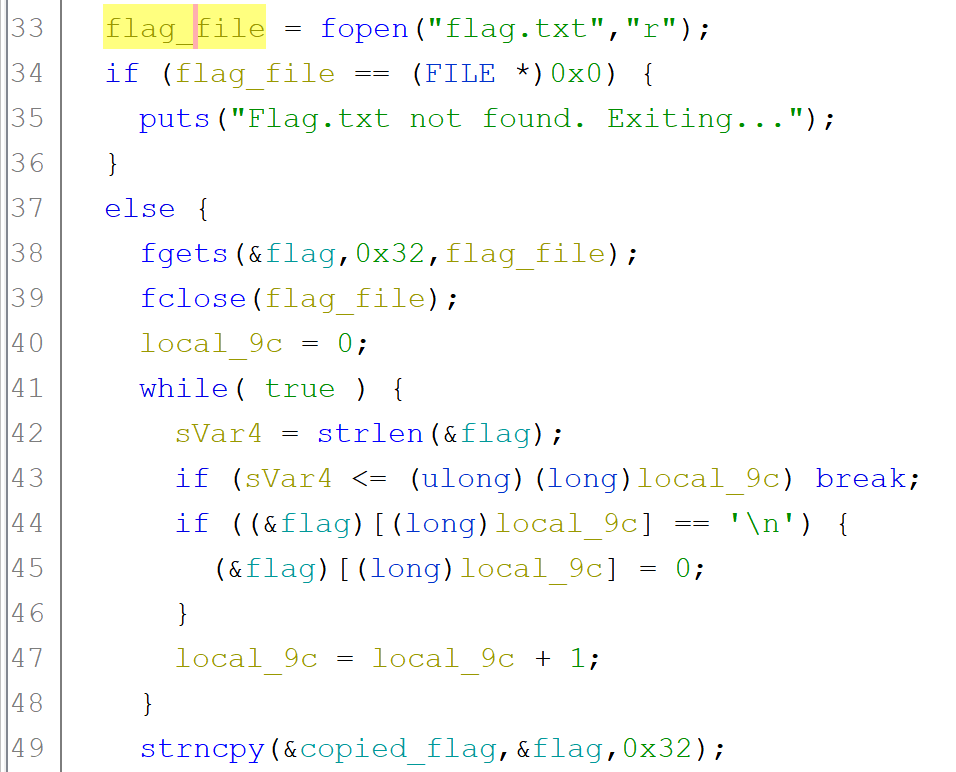
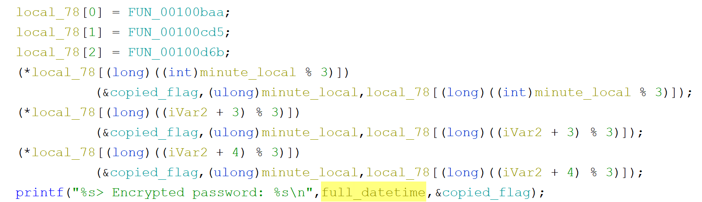
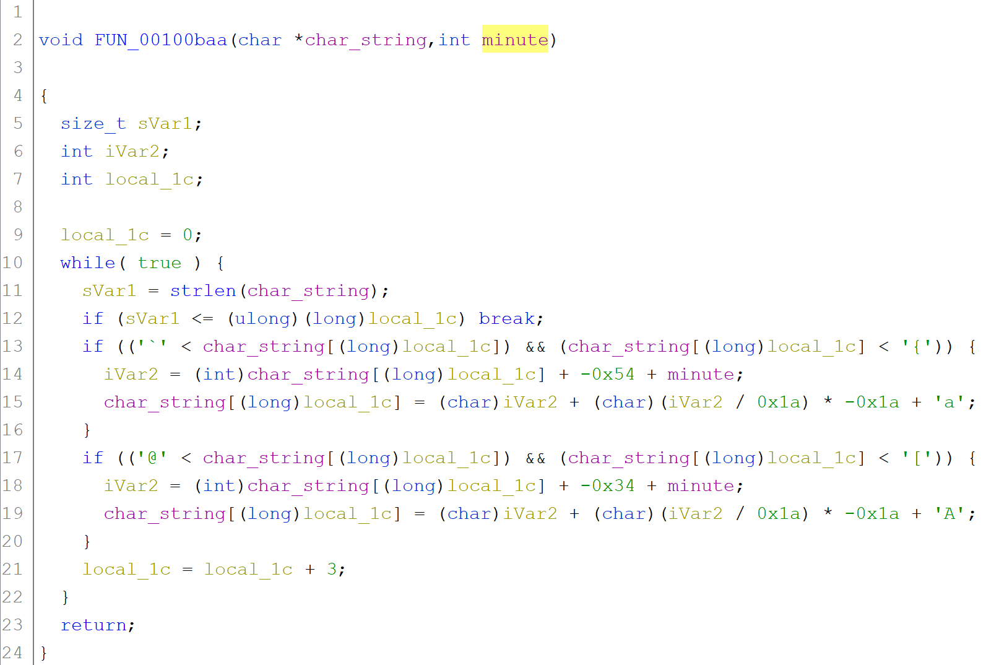
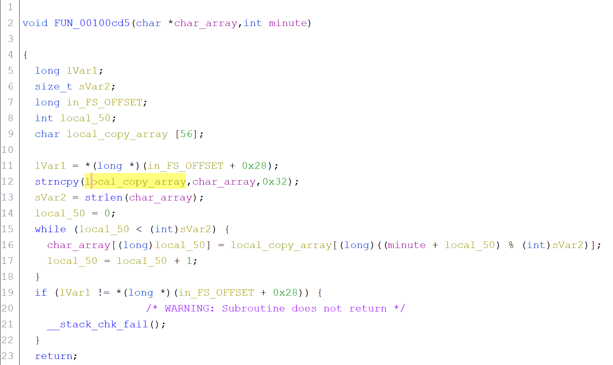
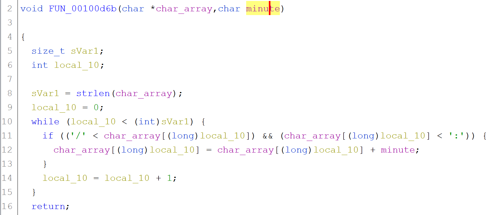

# It's about time...
Let's see if you can figure out this password..

Use the following command to connect to the server and interact with the binary!

	nc <host> <ip>

## Setup
Provide the binary to the user and let them know the hostname/port to connect to via netcat.
Build the docker container

        docker build -t about_time .

Then run it

	docker run -it --rm -p 4321:4321 about_time

## Solution
The provided solution.py script is commented and can be used to solve the challenge.

To get started first we're gonna just run the binary. It prints out a prompt that includes the datetime as well as a password that is encrypted.
After running it a few times, you'll notice that the encrypted password changes every so often. Let's take a look at the binary in a disassembler to see if we can get a good idea of what is going on...

I like to use Ghidra, and the first thing to notice is that there are no symbols loaded - it's a stripped binary. This means that we can't just jump to main and start looking at the disassembly. However, it's still relatively simple to find the address of main.

In the __libc_start_main function, we can see that FUN_00100ebe is the first argument. This is the "main" function of the binary. I'm gonna rename that function to "main" in Ghidra.

At the beginning of the function, a signal handler is set to handle 0xe, which is SIGALRM. Looks like it is set to alarm for 5 seconds with the function FUN_00100e60.

Looks like it sets values to null and random. It is a function that messes with the binary after 5 seconds to increase debugging difficulty. Ignore this.

Next in main, the program writes the datetime into a variable as well as just the current minute into a variable. The minute is converted to an integer in the equation (minute % 6) + 2, which is stored into a global variable that I will call "minute".
It looks like it then reads the flag from a text file into a global variable that is stripped of its newline character and copied into another global variable. I have renamed the variables to indicate such.

In the next part, we see an array being assigned pointers to 3 different functions

You can see that right afterwards, all 3 functions are being called. However, the order in which they are called is determined by the "minute_local" variable, which is the same thing as the "minute" variable described above. It calls each of these with these arguments - a pointer to the copied_flag and the value of the minute variable.
It should look something like this:

	function_array = [fun1,fun2,fun3]
	function_array[minute % 3](&copied_flag,minute)
	function_array[(minute + 1) % 3](&copied_flag,minute))
	function_array[(minute + 2) % 3](&copied_flag,minute))

The main function then prints out the encrypted copied_flag, gets the user prompt, then follows the same algorithms to encrypt the users input. Let's look at each of the functions in the array

The first function looks like it iterates over the input string in the first argument and applies some operation on each character. One thing to note is that it iterates over every 3rd element.

In the screenshot, it shows that it is checking for characters inbetween '`' and '{' as well as '@' and '['. It may be just because of the way the compiler does things, but this is actually checking to see if its in the ranges 'a'-'z' and 'A'-'Z'.
If so, it adds -0x54 + minute (or -0x34 + minute) to the character, then does a divide/multiply by 26 (which is the modulus operation) and then adds 'a' or 'A'
If you think about it, this is simply rotating the character through the alphabet. A cesar cipher that depends on the value of minute.

	check the solution script for an example of how to reverse that cipher

The second function again iterates through the argument 0 char array. This one simply assigns each value to another offset from the copied array. Simply put, it rotates the entire array by the offset defined by the minute variable.

	check the solution script for an example of how to reverse this

The third and final function iterates through the char array again. This time it checks for values between '/' and ':', which is actually '0' and '9'. If so, it adds the value of 'minute' to the char at that index. Pretty simple.

	check the solution script for an example of how to reverse this

At the end, it calls another function that takes the encrypted flag and your encrypted input as arguments. If they are the same, then it prints out the flag.

Now, we put the reverse of each of those functions and then perform them in the reverse ordering, again depending on the value of minute. The solution script provided shows how to do so.

