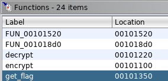
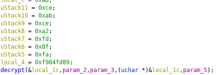
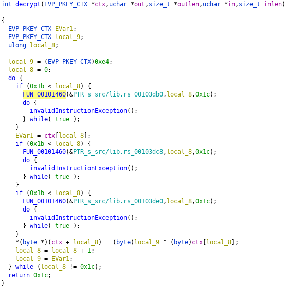
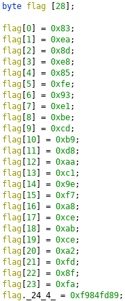

# Rusty at Reversing?

Shared object rust reversal with no standard libraries packed in (I mean none).

## Design

Actually there's a lot of really careful flags to ensure that:
1. The library looks like a typical Rust binary (with safety checks) and not like pure C.
   - If you want to see the difference for personal edification, change `opt-level` to `'z'`.
2. The library has some extraneous functions but not the standard lib.
   - If you want to see the difference, add `lto = true` under `[profile.release]`.
3. The library can be analysed by most reverse engineering frameworks relatively trivially.
   - If you want to see the difference:
     - Change the `loop` block with `if i == 28...` to a `for i in 0..28` (LLVM unrolling)
     - Change `cdylib` to `dylib` in `Cargo.toml`
3. Function names are not mangled so that users can actually find the right functions.
   - If you want to see the difference, remove `#[no_mangle]`.
4. The .so file isn't enormous.
   - `#[no_mangle]` enforces that the debug symbols remain for those functions, so we can strip the binary.
   - To see the difference, remove `RUSTFLAGS='-C link-args=-s'`

Amusingly, these changes seem to really confuse Rust and lead to some odd choices in the reversed binary.

## Solution 1: Linking, like a madlad

If you were an absolute madlad, you could just choose to link a C program to the functions. I have provided this
solution for personal edification. This is not particularly difficult but I doubt it would occur to most at first.

Make sure you build with `gcc link_solution.c target/release/librusty_at_reversing.so`.

## Solution 2: Reversing

Let's do the intended solution: manual labour.

### Reversing the get_flag function

Pop the library open in Ghidra and, lo!:



Traverse into it a bit and we find:
1. A huge block of bytes (indicating an array of some sort) and
2. A call to `decrypt` passing a pointer to the first byte of our block.



### Reversing the decrypt function

Below is the entire decompiled `decrypt` function here:



Now, remember how I said that compiling like this made Rust unhappy? The repeated bounds checks and parameters
above demonstrate that pretty well. The do-while bounds prevent this condition from occurring, and these would normally
be optimised out by LLVM.

Discarding the bounds checks and the unused parameters, this function is quite straightforward. To write some
pseudocode:

```text
local_9 = 0xe4
local_8 = 0
do {
    EVar1 = ctx[local_8]
    ctx[local_8] = local_9 ^ ctx[local_8]
    local_8++
    local_9 = EVar1;
} while (local_8 != 0x1c)
```

This appears to be a simple dragging XOR. This do-while can additionally be turned into a for loop quite trivially.

### Getting the flag

We'll write a C implementation because Ghidra provides us with a pretty neat decompiler utility.

First, we retype local_1c to a byte[28] and rename it to flag:



We then copy this over to our solution file to construct our main (fixing the last entry little-endianly):

```
int main() {
    char flag [28];

    flag[0] = 0x83;
    flag[1] = 0xea;
    flag[2] = 0x8d;
    flag[3] = 0xe8;
    flag[4] = 0x85;
    flag[5] = 0xfe;
    flag[6] = 0x93;
    flag[7] = 0xe1;
    flag[8] = 0xbe;
    flag[9] = 0xcd;
    flag[10] = 0xb9;
    flag[11] = 0xd8;
    flag[12] = 0xaa;
    flag[13] = 0xc1;
    flag[14] = 0x9e;
    flag[15] = 0xf7;
    flag[16] = 0xa8;
    flag[17] = 0xce;
    flag[18] = 0xab;
    flag[19] = 0xce;
    flag[20] = 0xa2;
    flag[21] = 0xfd;
    flag[22] = 0x8f;
    flag[23] = 0xfa;
    flag[24] = 0x89;
    flag[25] = 0xfd;
    flag[26] = 0x84;
    flag[27] = 0xf9;

    decrypt(&flag);
    printf("%.28s\n", flag);
}
```

Then, using our pseudocode from earlier, we write the decrypt function:

```
void decrypt(char *flag) {
    char temp;
    char local_9 = 0xe4;
    char local_8 = 0;
    for (int i = 0; i < 28; i++) {
        temp = flag[i];
        flag[i] = local_9 ^ flag[i];
        local_8++;
        local_9 = temp;
    }
}
```

Bundling it all together and compiling, we get the flag. You can compile `solution.c` to this result.