# Splattercalc

```text
Reverse this binary to determine the input number required to read the flag on the remote server.
```

## Setup

1. `docker build -t splatter-calc:latest .`
2. `docker run --rm -d splatter-calc`
3. `nc 172.17.0.2 60032`

To build the local binary, use `cargo build --release`. You can install cargo
[here](https://rustup.rs/).

## Brief Dev Description

This code uses a rather arcane feature of Rust (still "experimental") to invoke
function pointers stored in an array. This behaviour is used along with a PRNG
system to generate a number by invoking a function based on the current PRNG
state.

The result is the repeated modification of two values: the "result" value, which
is modified by the function pointers themselves, and the "state" value, which is
the current state of the PRNG system.

The trick to solving this problem is the realisation that a) both the final
"result" value and the "state" value are checked, b) the "result" value is not
reversible, but the "state" value is, and c) only the "state" value needs to be
reversed, as it implies the "result" value.

## Solution

As this is a reversing challenge, I have provided an example reversing approach.

### Finding `main`

Rust starts a little differently, so following it in with Ghidra:

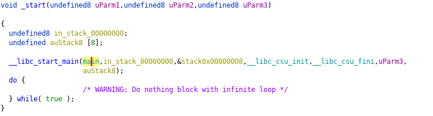

Following `main`...

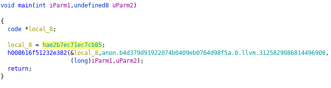

Following `local8` (`h00...` can be interpreted as `__rustc_start_main`; this is
  LLVM mangling, unavoidable)

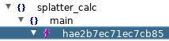

Symbols window confirms that we have found the main method in the
splatter_calc namespace. We'll rename that to `actual_main`.

### Finding Technique

We know by running it the first time that we get the output:
```text
Please enter an initial rng: 1234
Oops, you didn't guess the right number. You got 8968822505825569188 with final state 17380140262299787378
```

We learn a few things:
 - There's PRNG involved (we provide what is likely a seed value, as behaviour
   is consitent between executions)
 - There are two values we get: some result value (unlabelled) and a state value
 - Input is taken from STDIN in a line format (we can look for `read_line` or
   buffered reading), then parsed; we can find the uses of that parsed number

Using our handy-dandy symbol tree, we find the `stdin` namespace:

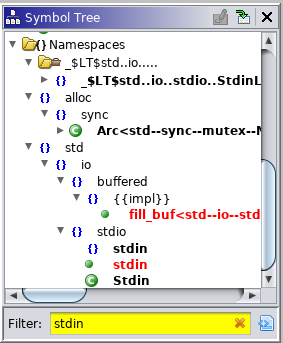

Tracing the functions of the class `Stdin`, we find that stdin gets locked in
`actual_main`.

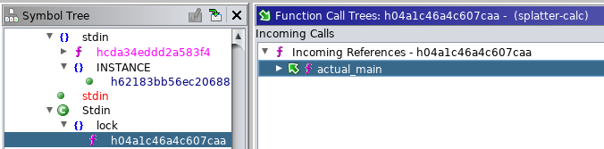

Forward-slicing the result of that function (and thus finding the uses of that
  lock) finds us this invocation:

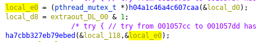

Which is passed to a function which, when followed...

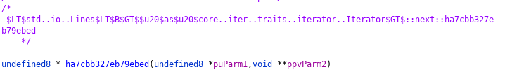

reveals itself to be a `next` invocation on an internal iterator, implying the
following construct:

```rust
  std::io::stdin().lock().lines().next()
```

This is a common construct for fetching the next line of standard input.

`local_118`, which appears to be the result of this invocation, passes hands a
few times; it is trimmed (as `uVar3`) then parsed to a `u64` (as `local_130`).
If parsing fails, then 0 is used instead. This result is stored in `ppabVar1`.

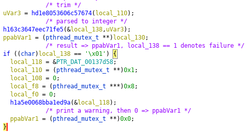

The next usage of `ppabVar1` begin a crypto-like technique.

### Reversing the Cryptographic Technique

`ppabVar1` gets used next to index the odd members an 16-member array stored at
`local_b0`, which then gets offset by `0x18` and then invoked directly using the
even member, `0xcafebabe` (a "leetspeak" number), and `ppabVar1`.

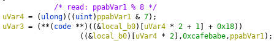

Let's take a look at that array to get an idea of what we're looking at:

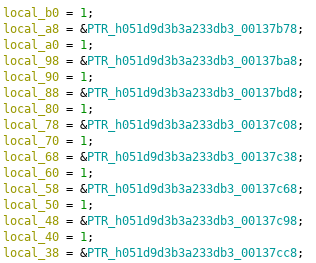

Given the local offsets of 8-byte words and the global pointers, this looks like
the setup of a fixed-length Rust array of references. Additionally, if we follow
one of these global pointers (denoted by `PTR_...`)...

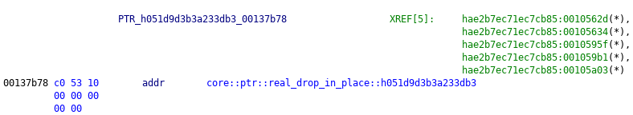

we find a pointer to a ["drop-in-place" destructor](https://doc.rust-lang.org/std/ptr/fn.drop_in_place.html).
It's likely that we're looking at a [trait object vtable](https://huonw.github.io/blog/2015/01/peeking-inside-trait-objects/)
given that, together, we see:

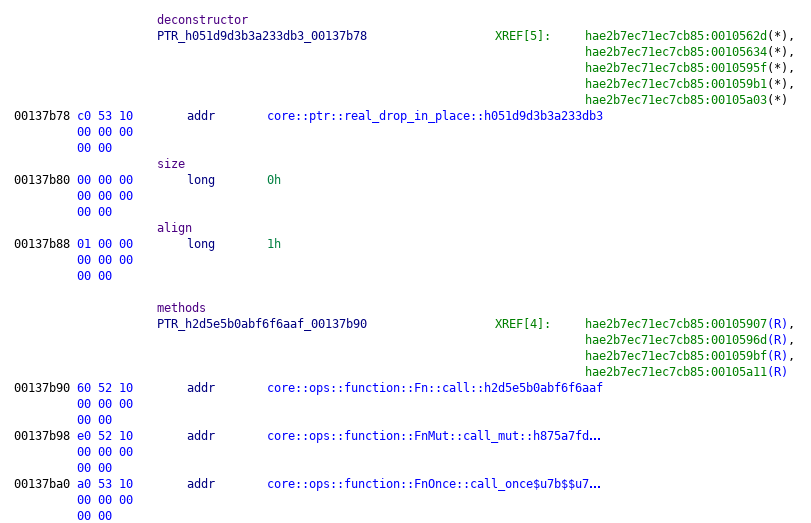

So we've got an array of pointers to vtables -- neat. Effectively: an array of
function pointers. Looks like the function used to modify some variable is being
selected by `ppabVar1`.

Additionally, we have a recurring pattern of usage (likely an LLVM optimisation)
where:
 - `uVar4` is set to `lVar6` (initially `ppabVar1`) % 8
 - `uVar3` is set to the result of the invocation of the `uVar4`-th function,
   passed the parameters of `uVar3` (initially `0xcafebabe`) and `lVar6`
 - `lVar6` is set to `lVar6` * `0x83f66d0e3` + `0x24a452f8e`

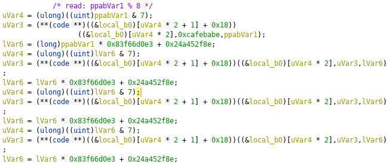

This pattern occurs 8 times (last time, `pabVar5` is used instead of `uVar3` and
  `__ptr` is used instead of `lVar6`). Then we find the following if statement:

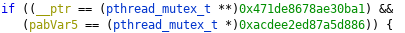

If this check succeeds, a string to path function is invoked which converts
"flag.txt" into a local path for file reading:

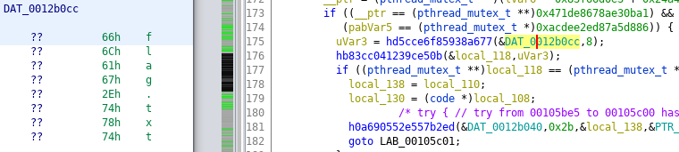

That file is read to string in the statement immediately following as confirmed
by the namespace (left to reader). Thus, if our entered number `ppabVar1` =>
`lVar6` => `__ptr` and `0xcafebabe` => `uVar3` => `pabVar5` both match the
numbers in the if statement, then the `flag.txt` file is read and printed to the
console (`local_118` is used by `std::io::stdio::_print` later).

### Logic Time

It should be fairly obvious that both `lVar6` and `uVar3` are dependent on the
initial state (read: our entered value) and that it should always be the same;
this is confirmed by the consistency seen earlier by trialing the program.

`uVar3` would be quite difficult to reverse, as its modifications depend on
the current state of `lVar6`. `lVar6`, however, uses a consistent modification
technique throughout:

```text
lVar6 = lVar6 * 0x83f66d0e3 + 0x24a452f8e
```

Thus, if we wanted to reverse lVar6, we'd want to do:

```text
lVar6 = (lVar6 - 0x24a452f8e) * 0x83f66d0e3^-1
```

Since `lVar6` is a 64-bit integer (it's a `long`), then each iteration must be
considered mod 2^64. `0x83f66d0e3` => `35423441123`, and, since we're lazy, we
use Wolfram Alpha to calculate that [35423441123^-1 mod 2^64 =
4882305260382647499](https://www.wolframalpha.com/input/?i=35423441123%5E-1+mod+2%5E64).

Our reversal function is now:

```text
lVar6 = (lVar6 - 0x24a452f8e) * 4882305260382647499
```

We apply this function 8 times from `lVar6 = 0x471de8678ae30ba1`:

```rust
fn main() {
  let mut lVar6: u64 = 0x471de8678ae30ba1;

  for _ in 0..8 {
    lVar6 = lVar6.wrapping_sub(0x24a452f8e).wrapping_mul(4882305260382647499);
  }

  println!("{}", lVar6);
}
```

This gets us the result `982730589345`, which, when we use it, gets:

```text
$ nc 172.17.0.2 60032
Please enter an initial rng: 982730589345
gigem{00ps_ch3ck_y0ur_7upl35}
```
